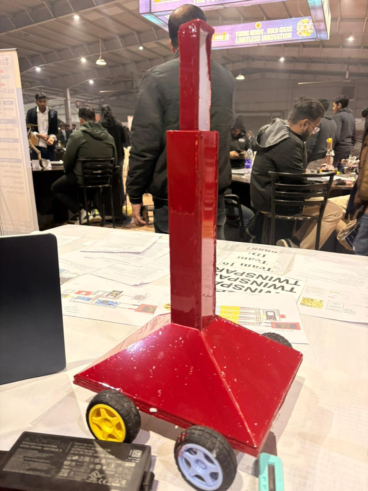
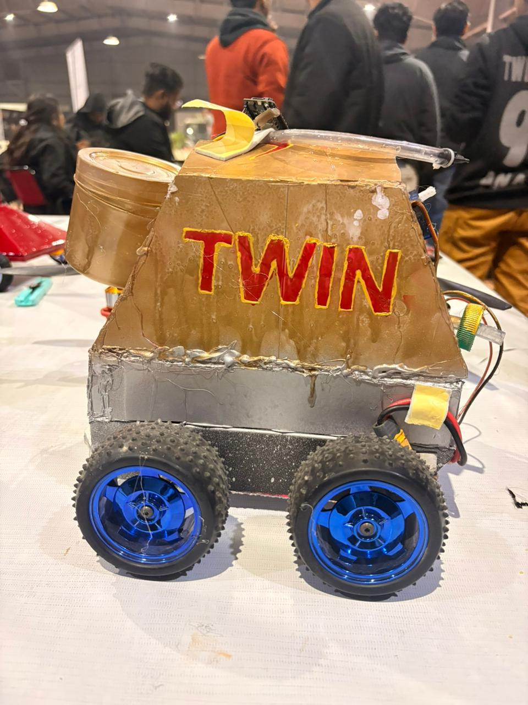
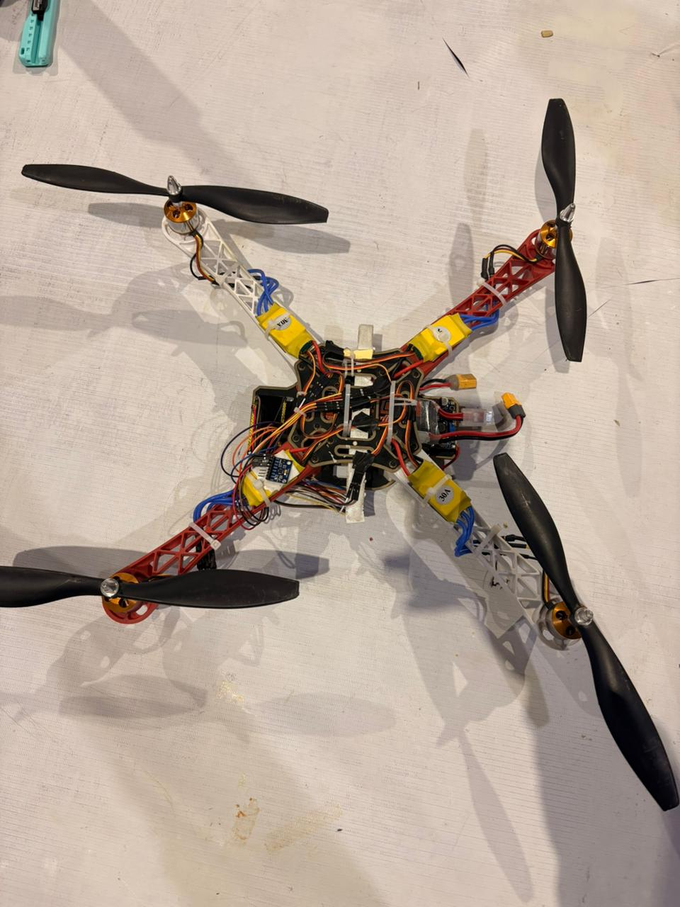

<h1 align="center">🌱 Intelligent Pesticide Sprinkling System</h1>

<h2 align="center">🏆 Smart India Hackathon 2025 — Grand Finalist</h2>

<p align="center">
  <b>Twin Spark</b> • Integral University
</p>

<p align="center">
  An AI-powered precision agriculture system that detects plant diseases,
  estimates infection levels, and enables intelligent pesticide spraying.
</p>

<p align="center">
  
  
  
  
</p>

---

## 🏆 Our SIH 2025 Journey

We are **Team Twin Spark**, a team from **Integral University**, and this
project was developed for **Smart India Hackathon (SIH) 2025**.

Our team successfully reached the **Grand Finale of Smart India Hackathon
2025** with the problem statement:

> **"Intelligent Pesticide Sprinkling System determined by the infection level of plants."**

The project focuses on using **Artificial Intelligence, Computer Vision and
automation** to make pesticide application more intelligent and targeted.

Instead of treating an entire field uniformly, the system analyzes plant
images, identifies disease conditions and determines the level of infection
to support more precise pesticide application.

---

## 🌾 Problem Statement

Conventional pesticide spraying often applies chemicals uniformly across
an entire field, even when only certain plants or areas are affected.

This can lead to:

- Excessive pesticide usage
- Increased agricultural costs
- Unnecessary chemical exposure
- Environmental impact
- Inefficient treatment of infected plants

The challenge was to develop an intelligent system capable of determining
the infection level of plants and using that information to make better
spraying decisions.

---

## 💡 Our Solution

Our solution combines **AI-based plant disease detection** with an
infection-level analysis pipeline.

A plant image is provided to the system and processed by the trained
machine-learning model. The model predicts the plant disease along with
its confidence, after which the system analyzes the infection level and
provides a spraying recommendation.

### Overall Pipeline

```text
                    🌿 Plant Image
                         │
                         ▼
                Image Preprocessing
                         │
                         ▼
                 🤖 AI/ML Model
                         │
                         ▼
              Disease Classification
                         │
                         ▼
              Prediction + Confidence
                         │
                         ▼
             Infection-Level Analysis
                         │
                         ▼
              🌱 Spraying Decision
                         │
                         ▼
              🎯 Targeted Treatment
```
---

## 🤖 My Contribution — AI/ML

I worked primarily on the AI/ML side of the project, developing the
plant-disease detection and prediction pipeline used by the system.

My work included:

Developing the plant disease classification model
Preparing and processing the image dataset
Building the model training pipeline using PyTorch
Training and evaluating the deep-learning model
Implementing model inference and prediction
Working with model checkpoints and model weights
Generating disease predictions and confidence scores
Developing the infection-analysis pipeline
Integrating the trained model with the backend
Testing predictions using plant images
Generating prediction results for evaluation

The trained model used by the project is available in:

```text
checkpoints/best_model.pth
```
This repository therefore contains not only the application code, but also
the trained model used for inference.

---

## 🧠 AI / ML Approach

The system uses a deep-learning-based image classification approach for
plant disease detection.

The general process is:

```text
Input Image
     │
     ▼
Image Preprocessing
     │
     ▼
Feature Extraction
     │
     ▼
Deep Learning Model
     │
     ▼
Disease Prediction
     │
     ├──────────────► Confidence Score
     │
     ▼
Infection Analysis
     │
     ▼
Spraying Recommendation
```
The model is implemented using PyTorch and TorchVision, with the
supporting data-processing and evaluation pipeline implemented in Python.

---
# 🎯 Key Features
### 🌿 Plant Disease Detection

The trained AI model analyzes plant images and predicts the corresponding
disease class.

### 📊 Prediction Confidence

The system provides prediction confidence along with the model output.

### 🧪 Infection-Level Analysis

The prediction pipeline analyzes the infection level of the plant and
converts it into an actionable recommendation.

### 🎯 Targeted Spraying

The ultimate goal is to use infection information to support targeted
rather than unnecessary uniform pesticide application.

### 🚀 FastAPI Backend

A FastAPI backend provides an interface for uploading plant images and
running predictions.

### 🖼️ Image-Based Prediction

Users can upload a plant image through the backend interface and receive
the model's prediction output.

---

## 🛠️ Technology Stack

| Category | Technology |
|:---|:---|
| **Programming Language** | Python |
| **Deep Learning** | PyTorch |
| **Computer Vision** | TorchVision, Pillow |
| **Data Processing** | NumPy, Pandas |
| **Machine Learning** | Scikit-learn |
| **Backend** | FastAPI |
| **API Server** | Uvicorn |
| **Model Format** | PyTorch `.pth` |
| **Development** | VS Code / Python Virtual Environment |
---

## 🏗️ System Architecture

                         ┌──────────────────────┐
                         │     Plant Image      │
                         └──────────┬───────────┘
                                    │
                                    ▼
                         ┌──────────────────────┐
                         │ Image Preprocessing  │
                         └──────────┬───────────┘
                                    │
                                    ▼
                         ┌──────────────────────┐
                         │   AI Disease Model   │
                         │       PyTorch        │
                         └──────────┬───────────┘
                                    │
                         ┌──────────▼───────────┐
                         │ Disease Prediction   │
                         │ + Confidence Score   │
                         └──────────┬───────────┘
                                    │
                                    ▼
                         ┌──────────────────────┐
                         │ Infection Analysis   │
                         └──────────┬───────────┘
                                    │
                                    ▼
                         ┌──────────────────────┐
                         │ Spraying Decision    │
                         └──────────┬───────────┘
                                    │
                                    ▼
                         ┌──────────────────────┐
                         │ Targeted Treatment   │
                         └──────────────────────┘
---

## 📂 Project Structure

```text
Twin-Spark_SIH2025/
│
├── assets/
│   └── screenshots/
│       ├── Sample-image1.jpg
│       ├── Sample-image2.jpg
│       └── Sample-image3.jpg
│
├── checkpoints/
│   └── best_model.pth
│
├── data/
│   ├── classes.txt
│   └── labels.csv
│
├── results/
│   └── predictions.csv
│
├── src/
│   ├── train.py
│   ├── predict_and_analyze.py
│   ├── predict_and_infect.py
│   └── ...
│
├── test_images/
│
├── tools/
│
├── backend.py
├── requirements.txt
├── team_info.txt
├── .gitignore
└── README.md

```

## 🚀 Getting Started
1. Clone the Repository
```text
git clone https://github.com/Raaaaahil/Twin-Spark_SIH2025.git
cd Twin-Spark_SIH2025
```
2. Create a Virtual Environment
Windows
```text
python -m venv .venv
```
Activate it:
```text
.\.venv\Scripts\Activate.ps1
```
3. Install Dependencies
```text
python -m pip install -r requirements.txt
```
4. Run the Backend
```text
python backend.py
```
The FastAPI server runs locally at:
```text 
http://127.0.0.1:8000
```
The API documentation can be accessed through:
```txt
http://127.0.0.1:8000/docs
```
---
## 🔬 Model

The trained model is included in the repository:
```text
checkpoints/best_model.pth
```

The model is loaded by the prediction pipeline and used to perform
plant-disease inference.

The project also contains the training and prediction source code under:
```text
src/
```
This makes it possible to understand the complete workflow from training
to inference.

---

## 📈 Results

Prediction outputs generated during experimentation and inference are
stored under:
```text
results/
```

The repository includes:

```text
results/predictions.csv
```
which can be used to inspect prediction results produced by the system.
---
## 🖼️ Project Screenshots
<p align="center">    </p>
---
🏆 Smart India Hackathon 2025
Team Twin Spark

Our team developed this project as part of our Smart India Hackathon
2025 journey.

Achievement

🏆 Grand Finalist — Smart India Hackathon 2025

Problem Statement

Intelligent Pesticide Sprinkling System determined by the infection level
of plants.

Institution

Integral University

👥 Team

The project was developed collaboratively by Team Twin Spark for
Smart India Hackathon 2025.

The team worked across different areas including AI/ML, software
development, system integration and the overall agricultural automation
concept.

🌱 Why Precision Agriculture?

Agriculture increasingly requires solutions that can make better use of
resources while maintaining crop health.

By combining plant disease detection with infection-level analysis, an
intelligent spraying system can move towards:

```text
Traditional Approach
        │
        ▼
Uniform Spraying
        │
        ▼
Same Treatment Everywhere


             VS


Intelligent Approach
        │
        ▼
Plant Analysis
        │
        ▼
Disease Detection
        │
        ▼
Infection Assessment
        │
        ▼
Targeted Treatment
```
The project demonstrates how AI can be used as a decision-support
component in precision agriculture.
---
## 🔮 Future Scope

The current project serves as a prototype for an intelligent agricultural
spraying system. Future improvements could include:

📷 Real-time camera-based plant monitoring
🤖 Automated spraying mechanisms
📡 IoT-based communication between the AI system and spraying hardware
🗺️ Field-level disease mapping
📍 GPS-based location tracking
🌱 More detailed disease-severity estimation
⚡ Edge deployment for real-time inference
☁️ Cloud-based crop-health monitoring
📊 Historical crop-health analytics
🎯 Variable-rate pesticide application
---
## 📚 What This Project Demonstrates

This project combines multiple areas of computer science and engineering:
```text
Artificial Intelligence
        +
Computer Vision
        +
Deep Learning
        +
Backend Development
        +
Data Processing
        +
Agricultural Automation
        =
Precision Agriculture Solution
```
It also represents our team's experience of taking an idea from a
hackathon problem statement through development, experimentation,
integration and presentation at the SIH 2025 Grand Finale.

---

##👨‍💻 Developer Contribution

My primary contribution to Team Twin Spark's SIH 2025 project was the
AI/ML pipeline.

I worked on the development of the plant-disease detection model,
training workflow, model evaluation, inference pipeline and integration
of the trained model with the application.

The repository contains the implementation and trained model so that the
AI component can be explored directly.

---

##📌 Project Status

### 🏆 SIH 2025 Grand Finalist

Status: Prototype / Hackathon Project

The repository contains the implementation developed for the SIH 2025
problem statement along with the trained AI model and supporting
prediction pipeline.

---

## 📜 License

This project was developed as part of Smart India Hackathon 2025 by
Team Twin Spark.

Please refer to the repository and project files for usage and
attribution details.
